# Seminario de Práctica de Informática
## Actividad práctica N.º 2

**Proyecto:** Sistema de Gestión y Seguimiento de Asistencias Técnicas para una empresa que presta servicios de Internet y televisión por cable.

| | |
|---|---|
| Universidad | Siglo 21 |
| Alumno | Battagini, Gabriel Alejandro |
| Profesor | Virgolini, Pablo Alejandro |
| Código de materia | INF275-11987 |
| Modalidad | Individual |
| Tecnologías del prototipo | Java, Swing y MySQL |
| Entorno de desarrollo previsto | Visual Studio Code |

---

## 1. Introducción y continuidad del proyecto

Este trabajo continúa el proyecto de la primera actividad, orientado a centralizar el registro y seguimiento de solicitudes técnicas. La problemática consiste en la dispersión de información entre planillas y comunicaciones separadas, que dificulta conocer antecedentes, responsables y resultados de la atención (Battagini, 2026b).

Se mantiene la distinción entre **solicitud técnica**, que representa el inconveniente del cliente, y **asistencia domiciliaria**, que representa una visita para atenderlo. El sistema documenta las acciones de soporte remoto; no ejecuta comandos ni configuraciones sobre los equipos del cliente.

Se incorporan las observaciones docentes: revisión de objetivos, precisión de requerimientos y desarrollo del modelo de dominio. Del TP4 de Análisis y Diseño de Software se toma únicamente la organización que vincula artefactos UML, escenarios, procedimientos y resultados de prueba, sin trasladar su dominio ni sus funcionalidades (Battagini, 2026a).

### 1.1. Objetivos revisados

**Objetivo general del proyecto.** Desarrollar, para esta iteración, un prototipo operativo que centralice solicitudes técnicas y permita seguir su atención hasta el cierre, contemplando la resolución remota y las intervenciones domiciliarias.

**Objetivos específicos.** Analizar los requerimientos y reglas del circuito seleccionado; diseñar las clases, la interfaz y el modelo relacional; implementar ese circuito en Java con Swing y MySQL; y verificar su comportamiento mediante pruebas vinculadas con los requerimientos, registrando resultados y limitaciones.

**Objetivos del sistema.** Facilitar la consulta del estado de atención, la coordinación de visitas y la recuperación de antecedentes, manteniendo identificados los responsables de las operaciones. La reducción efectiva de demoras deberá evaluarse posteriormente con datos de uso; no se presenta como un resultado ya medido.

### 1.2. Ajuste de RF17

> **RF17 — Redacción revisada.** El sistema deberá permitir finalizar una asistencia domiciliaria realizada una vez registrados el diagnóstico, las tareas efectuadas y el resultado de la intervención. El cierre de la solicitud correspondiente solo se permitirá cuando el inconveniente haya sido registrado como resuelto. Si continúa pendiente, la solicitud deberá permanecer abierta.

El ajuste conserva el identificador y resuelve la ambigüedad respecto de RN06 y RN07. Finalizar una visita no equivale necesariamente a resolver el inconveniente. Se mantiene RN09: las solicitudes y asistencias finalizadas forman parte del historial.

### 1.3. Alcance de la iteración

Se implementan los casos CU01 a CU12 mediante dos recorridos: resolución remota y atención domiciliaria, incluida la continuidad después de una visita sin resolución. Se incluyen autenticación, permisos por rol y registro de responsables y momentos de operación.

Los clientes, domicilios, servicios y usuarios se precargan mediante SQL. CU14 se cubre parcialmente mediante la consulta y selección de los datos básicos; su administración completa y CU13 — Gestionar usuarios quedan para otra iteración. Esto no elimina RF01–RF03 ni RF20 del proyecto completo.

Se mantienen fuera del alcance facturación, gestión comercial, inventario, recursos humanos, monitoreo de red, diagnósticos automatizados, optimización de rutas y autoservicio del cliente. El prototipo es de escritorio: el técnico registra la visita desde un equipo autorizado, sin aplicación móvil ni funcionamiento desconectado.

## 2. Aplicación del Proceso Unificado de Desarrollo

Se adopta un desarrollo dirigido por casos de uso, con una arquitectura en capas y avances incrementales. Análisis, diseño, implementación y pruebas son flujos de trabajo relacionados; no se interpretan como fases rígidas que se realizan una única vez.

| Fase del PUD | Aplicación al proyecto |
|---|---|
| Inicio | El TP1 establece la problemática, objetivos, alcance y casos de uso iniciales. |
| Elaboración | Se completan dominio y estados, se precisa RF17 y se define la arquitectura. Se atienden riesgos de cierres incorrectos, pérdida de historial y permisos inadecuados. |
| Construcción | Se organiza el incremento en atención remota y atención domiciliaria. Cada recorrido relaciona casos de uso, diseño, persistencia y pruebas. |
| Transición | Se preparan instrucciones de instalación, datos de demostración y procedimientos de verificación. La aceptación con usuarios y la ejecución integrada en el equipo de entrega permanecen pendientes. |

El estado verificable de esta versión es: código compilado, reglas y construcción básica de pantallas comprobadas; pruebas con MySQL real preparadas, pero no ejecutadas en el entorno de elaboración. La trazabilidad se resume en la sección 9.

## 3. Etapa de análisis

### 3.1. Negocio y proceso de atención

La organización presta servicios residenciales de Internet y televisión. El proceso de soporte recibe un inconveniente, identifica el servicio afectado, evalúa su resolución remota y organiza una visita cuando corresponde. La propuesta agrega un registro común que vincula esas etapas, sin modificar los procesos comerciales de la empresa.

| Elemento | Definición |
|---|---|
| Entrada | Inconveniente informado y servicio identificado. |
| Participantes | Cliente, atención, soporte, coordinación y técnico de campo. |
| Decisión principal | Resolver remotamente o realizar una intervención presencial. |
| Salida | Resolución documentada o solicitud pendiente de continuidad. |
| Mejora buscada | Disponer de antecedentes y responsables sin reconstruir comunicaciones dispersas. |

Las decisiones de detalle que siguen son propuestas para el prototipo. No se presentan como resultados de entrevistas u observaciones realizadas: en el TP1 esas técnicas fueron planteadas como actividades de elicitación.

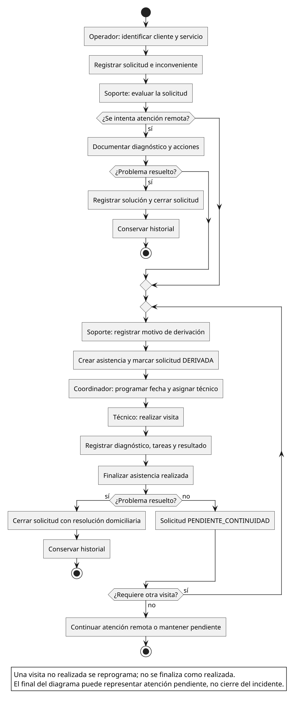

*Figura 1. Diagrama de actividad del proceso propuesto. Elaboración propia.*

La decisión de realizar una visita puede tomarse directamente cuando la evaluación identifica una necesidad física. Si una visita termina sin resolver el problema, se conserva la solicitud y se continúa la atención, en lugar de iniciar un reclamo sin vinculación con el anterior.

### 3.2. Actores y casos de uso

| Actor | Operaciones del prototipo |
|---|---|
| Operador de atención | Registrar y consultar solicitudes; seleccionar datos básicos; consultar historial. |
| Soporte técnico | Documentar atención remota, registrar resolución o derivar; consultar antecedentes. |
| Coordinador técnico | Consultar solicitudes y asistencias; programar, reprogramar y asignar técnicos. |
| Técnico de campo | Consultar sus asistencias; registrar diagnóstico, tareas y resultado; consultar antecedentes autorizados. |
| Administrador | Consultas de revisión en esta iteración. La gestión de usuarios permanece pendiente. |

El cliente participa del negocio, pero no opera directamente el sistema. La autenticación es una condición común de acceso, no una relación `include` repetida artificialmente en todos los casos. Como decisión de esta versión, coordinación y administración también pueden consultar historial; el técnico solo accede al historial de servicios sobre los que tiene alguna asistencia asignada.

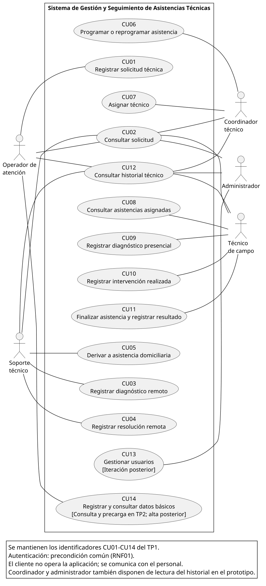

*Figura 2. Casos de uso del proyecto e identificación del alcance del prototipo. Elaboración propia.*

Se conservan los identificadores del TP1. CU06 y CU07 siguen siendo operaciones diferenciadas, al igual que CU09, CU10 y CU11, aunque se acceda a ellas desde una misma pantalla.

### 3.3. Especificación de los casos priorizados

**CU01 — Registrar solicitud técnica.** Actor: atención. Precondiciones: usuario autenticado y servicio activo con cliente, domicilio y contacto registrados. Flujo: seleccionar el servicio identificando sus datos asociados; ingresar el inconveniente; confirmar; validar; guardar la solicitud y su actividad. Postcondición: solicitud `REGISTRADA`, con identificador, responsable y fecha. Alternativas: datos incompletos o servicio inválido impiden confirmar; un error de persistencia revierte la operación.

**CU03 y CU04 — Registrar diagnóstico y resolución remota.** Actor: soporte. Precondiciones: solicitud abierta, sin visita activa. Flujo: consultar antecedentes; completar diagnóstico y acciones; indicar resultado; si está resuelto, registrar la solución; confirmar. Postcondición: se conserva una atención remota; el estado queda `EN_ATENCION_REMOTA` o `CERRADA`. Alternativas: diagnóstico, acciones o solución obligatoria faltantes impiden guardar. Una solicitud cerrada o con visita activa rechaza esta operación para evitar actuaciones contradictorias.

**CU05 — Derivar a asistencia domiciliaria.** Actor: soporte. Precondiciones: solicitud abierta, datos de contacto completos y necesidad presencial evaluada. Flujo: consultar antecedentes; ingresar motivo; confirmar; verificar que no exista otra asistencia activa; crear la asistencia vinculada y registrar el cambio. Postcondición: solicitud `DERIVADA` y asistencia `PENDIENTE`. Alternativas: una visita activa existente, datos incompletos o solicitud cerrada impiden derivar. No se exige un intento remoto previo.

**CU06 y CU07 — Programar o reprogramar asistencia y asignar técnico.** Actor: coordinación. Precondiciones: asistencia no finalizada y sin diagnóstico ni tareas registrados. Flujo: seleccionar asistencia; establecer fecha y hora o técnico activo; confirmar; recalcular el estado; registrar el cambio. Postcondición: asistencia `PROGRAMADA` solo cuando tiene fecha y técnico; en caso contrario continúa `PENDIENTE`. Alternativas: técnico inválido o modificación posterior al inicio del registro de la intervención se rechazan. Una visita no realizada se reprograma; no se registra como finalizada.

**CU09, CU10 y CU11 — Documentar y finalizar la visita.** Actor: técnico asignado. Precondiciones: asistencia programada y solicitud abierta. Flujo: guardar diagnóstico; guardar tareas; indicar resultado y su detalle; confirmar que la visita fue realizada; validar y finalizar. Postcondición: visita `FINALIZADA`; solicitud `CERRADA` cuando el resultado es resuelto o `PENDIENTE_CONTINUIDAD` cuando no lo es. Alternativas: datos faltantes, otro técnico, visita futura o doble finalización se rechazan. Si alguna escritura falla, se revierte el conjunto de cambios.

**CU02, CU08 y CU12 — Consultar solicitud, asignaciones e historial.** Precondición: usuario autenticado y autorizado. Se selecciona o filtra el registro, se recupera la información y se muestran estados, antecedentes y responsables. Las consultas no modifican información. El técnico no visualiza asignaciones ajenas; la falta de autorización o de conexión se informa sin presentar una operación como confirmada.

### 3.4. Modelo de dominio y reglas

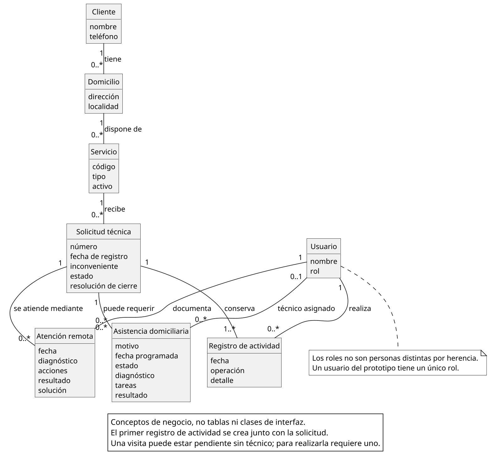

*Figura 3. Conceptos del negocio, atributos relevantes y multiplicidades. Elaboración propia.*

Un cliente puede tener varios domicilios; cada domicilio puede tener varios servicios. La solicitud corresponde a un servicio y, mediante este, al domicilio y cliente. Puede contar con varias atenciones remotas y asistencias domiciliarias. Los usuarios intervienen como responsables del registro, de las atenciones y de las visitas. Diagnóstico, acciones y resultado son información de la atención, no subsistemas independientes.

Además de RN01–RN09, se adoptan estas decisiones para acotar el prototipo: como máximo una asistencia no finalizada por solicitud; una nueva visita conserva las anteriores; una solicitud cerrada no admite nuevas intervenciones; y no se reprograma ni reasigna una asistencia con diagnóstico o tareas ya registrados. Estas restricciones deberán validarse con la organización antes de una implantación real.

### 3.5. Estados

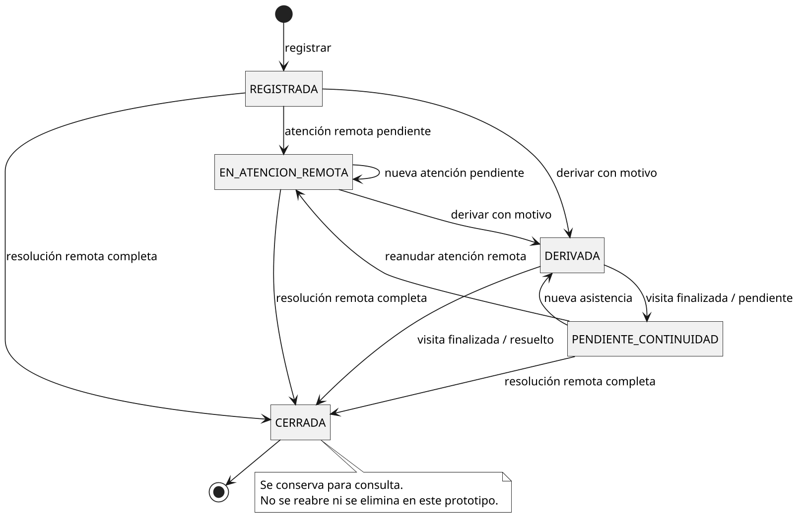

*Figura 4. Ciclo de vida de la solicitud técnica. Elaboración propia.*

`REGISTRADA` identifica una solicitud recibida; `EN_ATENCION_REMOTA`, una atención documentada aún no resuelta; `DERIVADA`, una solicitud con visita activa; `PENDIENTE_CONTINUIDAD`, una visita finalizada sin resolución; y `CERRADA`, una resolución documentada. Desde pendiente de continuidad puede retomarse el soporte remoto o generarse otra visita. Cerrar no significa borrar.

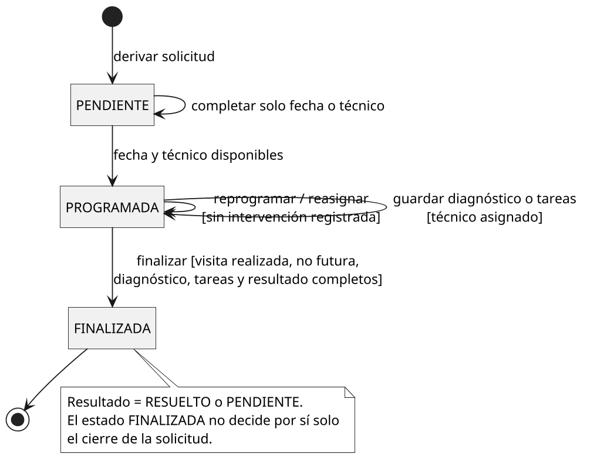

*Figura 5. Ciclo de vida de una asistencia domiciliaria. Elaboración propia.*

La asistencia es `PENDIENTE` mientras falta fecha o técnico, `PROGRAMADA` cuando tiene ambos y `FINALIZADA` cuando se documenta su realización. Su resultado, `RESUELTO` o `PENDIENTE`, es independiente del estado: una visita finalizada puede no haber resuelto el inconveniente.

## 4. Etapa de diseño

### 4.1. Arquitectura y responsabilidades

Se adopta una aplicación de escritorio con tres capas lógicas, conforme a RNF07. No se incorporan frameworks de persistencia ni un servidor web: el acceso se realiza mediante JDBC y SQL explícito.

| Capa | Clases principales | Responsabilidad |
|---|---|---|
| Presentación | `VentanaLogin`, `VentanaPrincipal`, `TareaInterfaz` | Obtener entradas, mostrar datos y mensajes y ejecutar las operaciones sin bloquear el hilo de eventos. |
| Negocio | `AutenticacionServicio`, `SolicitudServicio`, `AsistenciaServicio`, `ReglasAtencion` | Comprobar permisos y reglas, coordinar operaciones y delimitar transacciones. |
| Acceso a datos | `SolicitudDAO`, `AsistenciaDAO`, `AtencionRemotaDAO`, `ActividadDAO`, `UsuarioDAO`, `CatalogoDAO` | Ejecutar consultas y actualizaciones parametrizadas; convertir resultados en objetos. |
| Apoyo | `ConexionBD`, `SeguridadClave` y clases del paquete `modelo` | Configuración, comprobación de contraseñas y transporte de datos. |

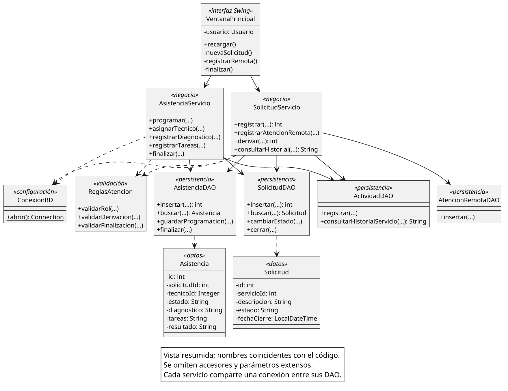

*Figura 6. Vista de diseño del circuito principal. Elaboración propia.*

Los diagramas se generan desde fuentes PlantUML y se incorporan como PNG (PlantUML, s. f.). El diagrama de clases muestra nombres coincidentes con el código y omite accesores y detalles secundarios para mantener su legibilidad. No reemplaza el modelo de dominio: aquí aparecen clases técnicas, dependencias y operaciones de implementación.

Cada servicio comparte una conexión entre los DAO que participan de la misma operación. Primero valida, luego escribe los cambios y la actividad y finalmente confirma. Ante un error ejecuta `rollback`. Se bloquea primero la solicitud al decidir sobre una atención, evitando que dos operaciones del propio sistema creen visitas simultáneas sobre el mismo estado anterior. Este mecanismo no sustituye una prueba de carga concurrente.

### 4.2. Interacciones principales

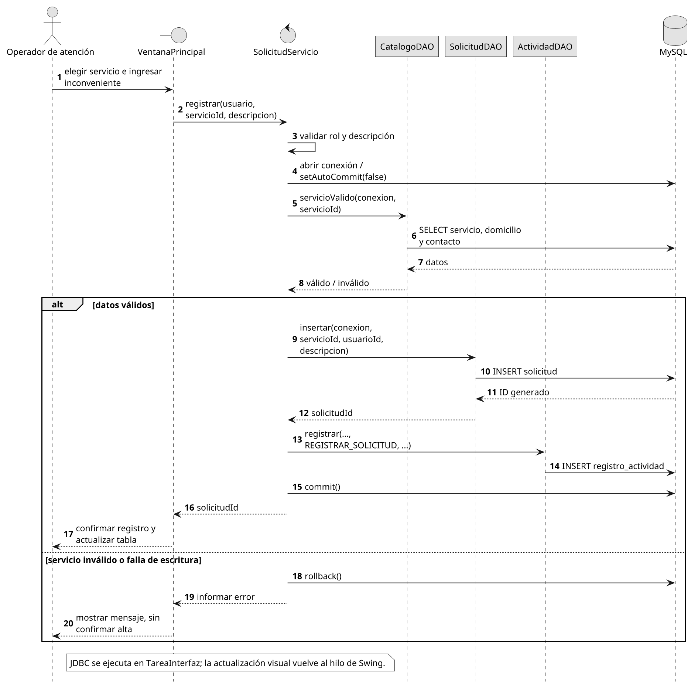

*Figura 7. Secuencia de CU01. Elaboración propia.*

La pantalla solicita el registro al servicio. Después de verificar permisos y datos del servicio, los DAO guardan solicitud y actividad dentro de una transacción. El identificador confirmado permite ubicar el registro desde las consultas.

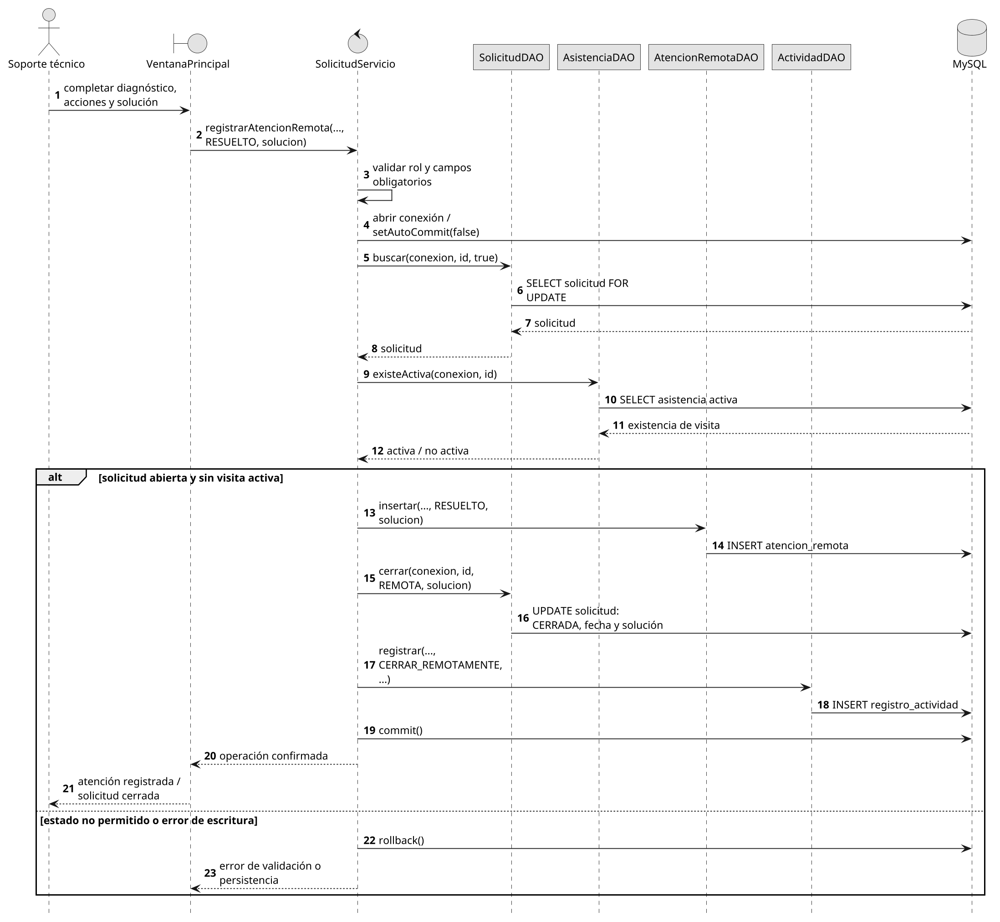

*Figura 8. Secuencia de CU04. Elaboración propia.*

Se verifica que la solicitud continúe abierta y sin visita activa. La atención remota, el cierre y la actividad se confirman conjuntamente; no debe quedar una resolución registrada con un estado de solicitud contradictorio.

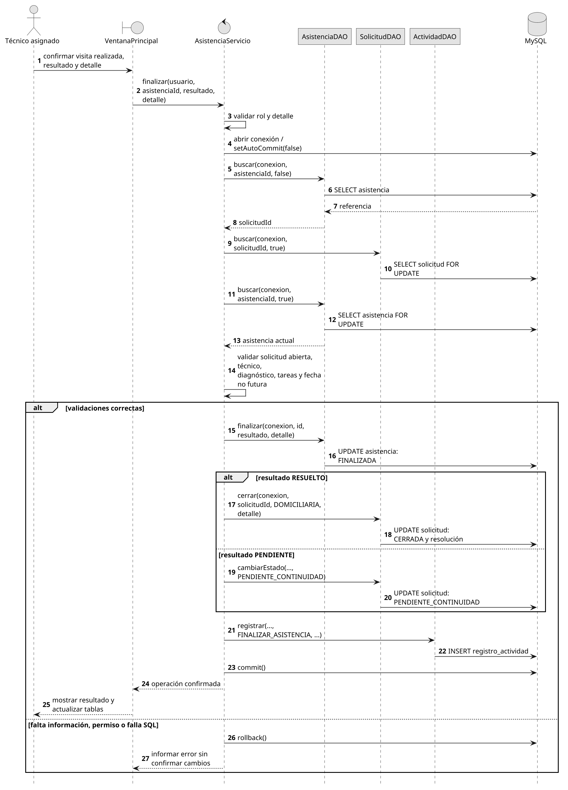

*Figura 9. Secuencia de CU11 con las alternativas de RF17. Elaboración propia.*

El técnico asignado debe haber registrado diagnóstico y tareas. La alternativa `RESUELTO` cierra la solicitud; `PENDIENTE` finaliza únicamente la visita y deja la solicitud disponible para continuar. El diagrama representa el orden lógico de llamadas; las operaciones de base de datos se ejecutan en segundo plano mediante `TareaInterfaz`.

### 4.3. Interfaz

La ventana principal tiene pestañas de solicitudes y asistencias, tablas no editables, filtros y botones por operación. Los formularios muestran etiquetas y mensajes de validación. La selección del servicio presenta conjuntamente cliente y domicilio para reducir asociaciones incorrectas.

Los permisos no dependen solo de ocultar botones: los servicios vuelven a comprobar el rol y, cuando corresponde, el técnico asignado. Las operaciones de persistencia usan `SwingWorker`; las actualizaciones visuales se realizan en el hilo de eventos, siguiendo el modelo de concurrencia de Swing (Oracle, s. f.-b).

## 5. Definición de la base de datos

### 5.1. Modelo relacional

Se define la base `gestion_tecnica` para MySQL 8.4, con tablas InnoDB y codificación `utf8mb4`. Los identificadores son claves primarias enteras autoincrementales; las fechas se almacenan como `DATETIME` y los textos con longitudes explícitas.

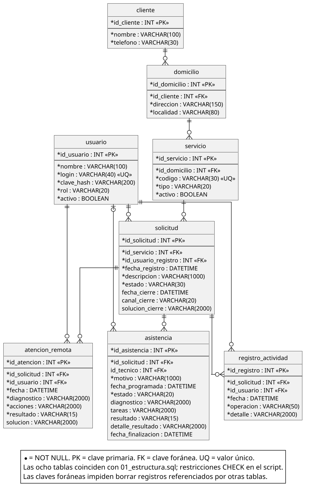

*Figura 10. Diagrama entidad-relación físico con claves y cardinalidades. Elaboración propia.*

| Tabla | Datos y finalidad | Relaciones principales |
|---|---|---|
| `cliente` | Identificador, nombre y teléfono. | Referenciado por `domicilio`. |
| `domicilio` | Dirección y localidad del cliente. | `id_cliente` → `cliente`. |
| `servicio` | Código único, tipo y condición activa. | `id_domicilio` → `domicilio`. |
| `usuario` | Nombre, acceso único, hash de contraseña, rol y condición activa. | Referenciado por registros y atenciones. |
| `solicitud` | Servicio, responsable inicial, descripción, estado, fechas y resumen del cierre. | Servicio y usuario de registro. |
| `atencion_remota` | Diagnóstico, acciones, resultado y solución cuando corresponde. | Solicitud y usuario responsable. |
| `asistencia` | Motivo, programación, técnico, diagnóstico, tareas y resultado. | Solicitud y técnico opcional hasta completar la programación. |
| `registro_actividad` | Operación, detalle, responsable y fecha. | Solicitud y usuario. |

El diagrama contiene los atributos; sus tipos, longitudes, restricciones y nombres definitivos se encuentran en `sql/01_estructura.sql`. Los campos cliente, domicilio y servicio de los objetos de consulta Java se obtienen mediante uniones; no implican columnas repetidas en `solicitud`.

### 5.2. Normalización e integridad

**Primera forma normal:** cada columna contiene un valor del atributo y no se almacenan listas de visitas o usuarios dentro de una fila. Las múltiples atenciones se representan mediante registros relacionados.

**Segunda forma normal:** las claves primarias son simples y los atributos de cada tabla dependen de su identificador, sin dependencias parciales de una clave compuesta.

**Tercera forma normal:** los datos del cliente no se repiten en domicilio, servicio o solicitud; la información del usuario no se copia en cada intervención. Para conocer el cliente de una solicitud se recorre `solicitud → servicio → domicilio → cliente`. Los estados y roles son conjuntos de valores controlados, no atributos descriptivos de otras entidades que obliguen a crear catálogos.

El resumen de cierre de `solicitud` se conserva como dato del cierre. Cuando coincide con el detalle de la atención resolutiva existe una redundancia deliberada: ambos se escriben en la misma transacción y luego son inmutables desde la aplicación. No se utiliza esta copia para sustituir el historial.

Las claves foráneas impiden referencias inexistentes y restringen el borrado de registros referenciados. `NOT NULL`, `UNIQUE` y `CHECK` controlan obligatoriedad, unicidad y coherencia de los valores. Se comprueba, por ejemplo, que una solicitud cerrada tenga fecha y solución, y que una asistencia finalizada tenga diagnóstico, tareas y resultado (Oracle, s. f.-d, s. f.-e).

Otras reglas, como exigir un usuario con rol técnico o impedir dos visitas activas, necesitan considerar varias filas y se aplican en los servicios dentro de una transacción; no se atribuyen a una restricción `CHECK` inexistente.

### 5.3. Consultas e índices

Se incorporan índices por estado y fecha de solicitud, servicio y fecha, técnico/estado/fecha programada y solicitud/fecha de actividad. Su selección responde a las consultas previstas; no demuestra por sí sola el cumplimiento de tiempos máximos.

Las listas del prototipo no implementan paginación. Antes de un uso con mayor volumen deberán medirse consultas, revisar planes de ejecución y acordar el objetivo de RNF08. No se inventan cantidades de usuarios ni un tiempo de respuesta aprobado.

## 6. Etapa de implementación

### 6.1. Organización del código

El proyecto utiliza Java 21, Swing y Connector/J 8.4.0, con configuración Maven. La estructura permite abrir la carpeta que contiene `pom.xml` desde VS Code. El README detalla preparación y ejecución; la documentación de VS Code y Connector/J sustenta la configuración del proyecto y la dependencia (Microsoft, s. f.; Oracle, s. f.-c).

```text
src/main/java/ar/edu/gestiontecnica/
  Main.java
  config/     Configuración de conexión
  modelo/     Usuario, Solicitud, Asistencia y Opcion
  dao/        Consultas y escrituras SQL
  servicio/   Reglas y coordinación del negocio
  ui/         Ventanas y tareas de Swing
src/test/java/ar/edu/gestiontecnica/
  PruebasUnitarias.java
  PruebasIntegracion.java
  PruebasInterfaz.java
```

El código utiliza nombres descriptivos, condiciones explícitas y comentarios en los pasos importantes. Se separan las operaciones de diagnóstico, tareas y finalización, sin concentrar todo el circuito en una única pantalla que escriba directamente en la base.

Las consultas utilizan `PreparedStatement` con parámetros; las conexiones y resultados se cierran mediante `try-with-resources`. Las transacciones coordinan las escrituras relacionadas (Oracle, s. f.-f, s. f.-g). La configuración local se guarda fuera del código y se excluye de Git. Las contraseñas de aplicación se verifican mediante PBKDF2 con sal, no se comparan como texto almacenado.

La implementación de RF17 se reconoce en `AsistenciaServicio.finalizar`: después de las validaciones, actualiza la asistencia, cierra la solicitud únicamente ante `RESUELTO` o la deja en `PENDIENTE_CONTINUIDAD`, registra la actividad y confirma la transacción.

### 6.2. Creación y carga de MySQL

| Script | Contenido |
|---|---|
| `01_estructura.sql` | Creación de la base, ocho tablas, claves, restricciones e índices. |
| `02_datos_iniciales.sql` | Dos clientes ficticios, domicilios, tres servicios y seis usuarios de demostración. |
| `03_usuario_bd.sql` | Plantilla de cuenta local de conexión y permisos limitados. Se ejecuta una copia local con contraseña propia, excluida de Git. |
| `04_operaciones_y_consultas.sql` | Inserción, modificación, consulta y borrado controlado; consultas funcionales Q01–Q10. |
| `05_pruebas_integridad.sql` | Cinco pruebas negativas para ejecutar separadamente en una base de práctica. |

Los scripts se entregan completos. Como ejemplo de creación, la primera tabla establece su identificador y los datos mínimos de contacto:

```sql
CREATE TABLE cliente (
    id_cliente INT AUTO_INCREMENT PRIMARY KEY,
    nombre VARCHAR(100) NOT NULL,
    telefono VARCHAR(30) NOT NULL,
    CONSTRAINT ck_cliente_nombre CHECK (CHAR_LENGTH(TRIM(nombre)) > 0),
    CONSTRAINT ck_cliente_telefono CHECK (CHAR_LENGTH(TRIM(telefono)) > 0)
) ENGINE=InnoDB;
```

La carga inicial no simula solicitudes ya atendidas: estas se generan usando el prototipo o las pruebas de integración. De ese modo puede observarse el recorrido de los datos desde el registro hasta el historial.

### 6.3. Inserción, consulta y borrado

El siguiente ejemplo crea un registro de práctica, consulta su contenido y lo elimina sin afectar antecedentes técnicos. Debe ejecutarse con la cuenta de administración de la base de práctica; la cuenta usada por la aplicación no tiene permiso de borrado.

```sql
START TRANSACTION;
INSERT INTO cliente (nombre, telefono)
VALUES ('Registro temporal para TP2', '000-TEMP');
SET @cliente_temporal = LAST_INSERT_ID();

SELECT id_cliente, nombre, telefono
FROM cliente WHERE id_cliente = @cliente_temporal;

DELETE FROM cliente WHERE id_cliente = @cliente_temporal;
SELECT COUNT(*) AS registros_restantes
FROM cliente WHERE id_cliente = @cliente_temporal;
COMMIT;
```

El resultado esperado de la última consulta es cero. Se trata de un resultado **esperado**, no de una evidencia de ejecución en MySQL. No se ofrece un botón para borrar solicitudes ni visitas finalizadas, en concordancia con RN09.

### 6.4. Consultas funcionales SQL

| Identificador | Consulta y utilidad |
|---|---|
| Q04 | Solicitudes abiertas, con cliente, domicilio, servicio y estado. |
| Q05 | Asistencias activas de un técnico, ordenadas por fecha. |
| Q06 | Diagnósticos y acciones remotas de una solicitud con su responsable. |
| Q07 | Historial de solicitudes de un servicio, incluidas las cerradas. |
| Q08 | Visitas finalizadas cuyo resultado fue pendiente. |
| Q09 | Cantidad de solicitudes por estado. |
| Q10 | Operaciones, fechas y usuarios del registro de actividad. |

Una consulta directamente vinculada con RF17 es Q08:

```sql
SELECT a.id_asistencia, a.id_solicitud, a.resultado,
       a.detalle_resultado, s.estado AS estado_actual_solicitud
FROM asistencia a
INNER JOIN solicitud s ON s.id_solicitud = a.id_solicitud
WHERE a.estado = 'FINALIZADA' AND a.resultado = 'PENDIENTE';
```

La solicitud podría encontrarse cerrada al consultar posteriormente, si otra atención resolvió el inconveniente. La consulta conserva el resultado histórico de aquella visita y muestra, separadamente, el estado actual.

## 7. Etapa de pruebas

### 7.1. Estrategia y criterios

Se relacionan casos de uso, reglas y componentes con pruebas positivas y negativas. La organización retoma el TP4 de Análisis y Diseño: definir el escenario, establecer entradas y resultados esperados, ejecutar, registrar el resultado obtenido y evaluar diferencias (Battagini, 2026a).

| Nivel o enfoque | Aplicación |
|---|---|
| Unitarias | Reglas de obligatoriedad, permisos, estados, finalización y comprobación de contraseñas. |
| Integración | Servicios, DAO y MySQL real: registro, derivación, cierre y conservación de antecedentes. |
| Sistema | Recorridos completos operados desde las ventanas Swing. |
| Regresión | Repetir pruebas después de modificar reglas, consultas o pantallas. |
| Aceptación | Confirmar con un usuario representativo que los recorridos satisfacen sus necesidades. Pendiente. |

Las pruebas negativas comprueban estados inválidos, accesos no autorizados y datos incompletos. No se afirma una auditoría de seguridad completa ni se reemplaza la aceptación funcional por comprobaciones de botones.

### 7.2. Casos priorizados

| Caso | Entrada o acción | Resultado esperado | Verificación preparada |
|---|---|---|---|
| CP01 | Atención registra un inconveniente para un servicio activo. | Solicitud identificada y actividad registradas. | I03; recorrido Swing. |
| CP02 | Soporte resuelve con diagnóstico, acciones y solución. | Solicitud cerrada sin crear visita. | I04–I05, incluyendo rechazo de datos vacíos. |
| CP03 | Soporte deriva con motivo. Repite la operación. | Una visita activa; segunda derivación rechazada. | I07–I08. |
| CP04 | Coordinación carga fecha y asigna técnico. | Pendiente con un dato faltante; programada con ambos. | U13–U15; I09–I10. |
| CP05 | Un técnico intenta registrar una visita ajena. | Operación rechazada sin modificar el diagnóstico. | U16; I11. |
| CP06 | Finalizar sin diagnóstico, tareas o detalle. | La visita no se finaliza. | U17–U19; I12. |
| CP07 | Finalizar una visita realizada con resultado pendiente. | Visita finalizada y solicitud pendiente de continuidad. | U22; I13. |
| CP08 | Segunda visita resuelve el mismo inconveniente. | Solicitud cerrada y ambas visitas conservadas. | I14–I15. |
| CP09 | Modificar una solicitud cerrada o finalizar dos veces. | Rechazo y conservación del historial. | U08, U24; I06, I16. |
| CP10 | Acceso inválido, consulta de asignaciones ajenas o clave incorrecta. | Rechazo o filtrado según corresponda. | U05–U07, U26; I02, I17. |
| CP11 | Borrar un cliente referenciado o insertar valores inválidos. | Rechazo por integridad referencial, CHECK o unicidad. | BD01–BD05. |
| CP12 | Finalizar una visita programada para el futuro. | Se exige una visita efectivamente realizada. | U23; recorrido Swing. |

Los identificadores U, I y BD corresponden a las comprobaciones implementadas en los archivos entregados; CP identifica el escenario funcional que las agrupa.

### 7.3. Procedimientos de ejecución

**PP01 — Resolución remota (CP01–CP02).** Ingresar como `atencion1`, registrar un inconveniente y anotar su identificador. Cerrar sesión e ingresar como `soporte1`. Seleccionar la solicitud, completar diagnóstico y acciones, indicar resultado resuelto y solución, y confirmar. Consultar el historial y Q07: deben observarse cierre remoto, responsable y antecedentes, sin una asistencia creada para esa solicitud.

**PP02 — Visita sin resolución y continuidad (CP03–CP08).** Registrar otra solicitud. Soporte la deriva; coordinación programa y asigna `tecnico1`. El técnico guarda diagnóstico y tareas, confirma la realización y finaliza con resultado pendiente. Comprobar que la visita terminó pero la solicitud no se cerró. Soporte genera una nueva asistencia para esa misma solicitud; coordinación la programa y asigna; el técnico documenta una solución y finaliza como resuelta. Consultar el historial: deben conservarse ambas visitas y sus resultados distintos.

**PP03 — Control de acceso y datos (CP05–CP06).** Con una asistencia asignada a `tecnico1`, ingresar como `tecnico2` y comprobar que no figura en sus asignaciones. Luego, con el técnico correcto, intentar finalizar antes de registrar diagnóstico y tareas: debe rechazarse. La prueba de integración invoca también el servicio con un técnico ajeno, para no limitar la verificación a la interfaz.

### 7.4. Registro de ejecución de esta versión

| Comprobación | Resultado obtenido | Estado |
|---|---|---|
| Compilación de fuentes principales y de prueba | Compilación con `javac --release 21`, sin errores. | Ejecutada. |
| U01–U28 | 28 comprobaciones aprobadas, ninguna fallida. | Ejecutadas. |
| UI01–UI03 | Construcción del login y controles básicos según rol en las ventanas principales. Tres comprobaciones aprobadas. | Ejecutadas, sin MySQL. |
| I01–I17 | No se obtuvo un resultado integrado: no había un servidor MySQL ni Connector/J instalado en el entorno de elaboración. | Pendientes. |
| BD01–BD05 y consultas Q01–Q10 | Scripts preparados; sin resultados de ejecución contra MySQL en esta versión. | Pendientes. |
| PP01–PP03 desde Swing | Procedimientos definidos; recorrido completo con persistencia aún no ejecutado. | Pendientes. |
| Aceptación, carga y rendimiento | No se realizó validación con usuarios ni medición representativa. | Pendientes. |

Las evidencias reales se encuentran en `evidencias/pruebas_unitarias.txt` y `evidencias/pruebas_interfaz.txt`. Las capturas de esa carpeta muestran ventanas construidas **sin conexión a la base y sin datos operativos**; no son comprobantes de funcionamiento integrado.

No se registraron fallas en las comprobaciones ejecutadas. Esto no permite concluir que no existan defectos en la integración pendiente. Todo defecto posterior deberá registrarse indicando caso, pasos, diferencia observada, severidad y estado. Se considerará crítico un cierre incorrecto, pérdida de historial o acceso no autorizado.

**Criterio de aceptación del incremento:** ejecutar los recorridos principales con MySQL, verificar persistencia y permisos, resolver defectos críticos y registrar los resultados. Este criterio todavía no se declara cumplido. El README incluye los comandos para completar la verificación sin modificar el código fuente.

## 8. Definiciones de comunicación

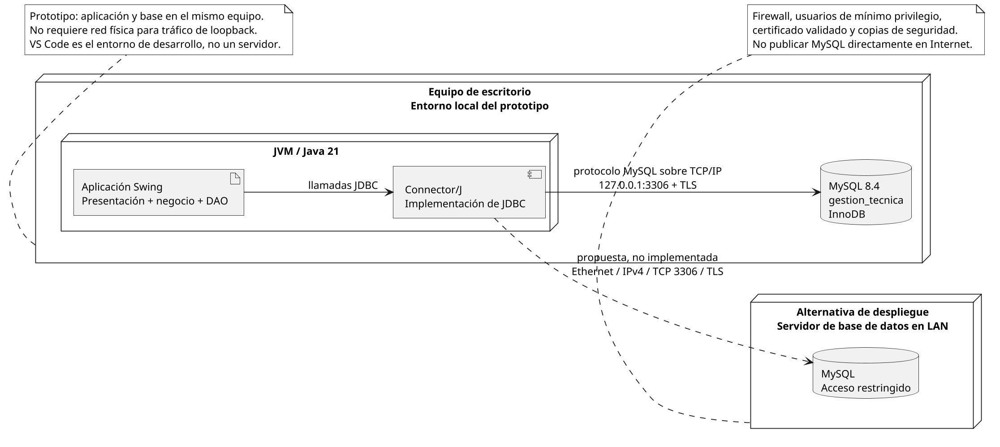

*Figura 11. Entorno local del prototipo y alternativa de red interna. Elaboración propia.*

| Aspecto | Definición para el proyecto |
|---|---|
| Entorno inmediato | Aplicación Swing y MySQL en el mismo equipo de práctica. Conexión a `127.0.0.1:3306`. |
| Acceso a datos | Java utiliza la API JDBC; Connector/J implementa la comunicación con el servidor MySQL. No se utiliza HTTP para esta conexión. |
| Transporte y red | Protocolo cliente-servidor de MySQL sobre TCP/IP. TCP proporciona un flujo ordenado y fiable, con mecanismos de retransmisión (Eddy, 2022). |
| Seguridad del enlace | Configuración local con `sslMode=REQUIRED` y cuenta que exige SSL. Cifra la conexión, pero no equivale a verificar la identidad del servidor. |
| Alternativa de infraestructura | Para varios puestos se propone un servidor interno, switch Ethernet, cableado de categoría 6 y enlaces de 1 Gb/s. Es una propuesta, no infraestructura relevada ni requisito mínimo medido. |
| Enlace de datos | En la alternativa cableada se emplearía Ethernet IEEE 802.3. La demostración por loopback no depende de un enlace Ethernet físico (IEEE 802.3 Working Group, s. f.). |
| Sistemas externos | No se implementan integraciones con facturación, monitoreo ni equipos del cliente. |

En una implantación por red se deberá configurar una dirección estable para el servidor, limitar el puerto de MySQL a equipos autorizados y verificar certificados mediante `VERIFY_IDENTITY`. La documentación de Connector/J diferencia este control de los modos que solo exigen cifrado (Oracle, s. f.-a).

La conexión requiere un archivo local de configuración excluido del repositorio. La cuenta `gt_app` no administra la base ni elimina historiales. Las fechas representan la hora local de la organización; la aplicación ajusta la sesión SQL al desplazamiento horario del equipo. Los puestos deben compartir configuración horaria y relojes sincronizados.

La arquitectura de escritorio con credenciales JDBC no protege por sí misma frente a un cliente modificado que use esas credenciales. Para un despliegue real con límites de seguridad más fuertes se deberá separar el acceso mediante un servicio de aplicación y reforzar autenticación, auditoría y operación. Esa infraestructura no forma parte del prototipo.

## 9. Trazabilidad

| Requerimiento | Casos de uso | Diseño e implementación | Persistencia | Pruebas |
|---|---|---|---|---|
| RF04–RF07 | CU01–CU02 | `SolicitudServicio`, `SolicitudDAO`; figura 7. | `solicitud`, `servicio`, `registro_actividad`. | CP01 / I03. |
| RF08–RF09 | CU03–CU04 | Registro remoto; figura 8. | `atencion_remota`, `solicitud`, actividad. | CP02 / I04–I05. |
| RF10 | CU05 | `SolicitudServicio.derivar`. | `asistencia`, `solicitud`, actividad. | CP03 / I07–I08. |
| RF11–RF12 | CU06–CU07 | `AsistenciaServicio.programar` y `asignarTecnico`. | `asistencia`, `usuario`, actividad. | CP04 / U13–U15, I09–I10. |
| RF13 | CU08 | Consulta de asignaciones según usuario. | `asistencia` y antecedentes relacionados. | CP10 / I17. |
| RF14–RF17 revisado | CU09–CU11 | Diagnóstico, tareas y finalización; figura 9. | `asistencia`, `solicitud`, actividad. | CP05–CP09 / U16–U24, I11–I16. |
| RF18–RF19; RNF06 | CU12 y operaciones anteriores | `ActividadDAO` e historial. | `registro_actividad` y atenciones conservadas. | CP08–CP09 / I15. |
| RNF01–RNF02 | Acceso y autorización transversal | Login, autenticación y `ReglasAtencion`. | `usuario`; consultas parametrizadas. | CP05, CP10 / U04–U07, U25–U28, I01–I02. |
| RNF03, RNF05, RNF07 | Todos los casos implementados | Capas, conexión, validaciones y transacciones. | MySQL, claves y restricciones. | Unitarias; integración y BD pendientes. |

RF01–RF03 se cubren parcialmente con datos precargados y consulta; RF20 y la administración completa de CU14 quedan para otra iteración. RNF08 permanece sujeto a acuerdo y medición. Los artefactos anteriores no implican que todas las pruebas asociadas estén ejecutadas: su estado se informa en la sección 7.4.

## 10. Conclusión y repositorio

La entrega desarrolla los modelos de análisis y diseño, el esquema relacional y el código del prototipo para el circuito de atención seleccionado. La separación entre solicitud y asistencia permite conservar una visita finalizada sin cerrar incorrectamente el inconveniente. El registro de actividad relaciona las operaciones con sus responsables.

Se verificaron la compilación, las reglas unitarias y aspectos básicos de la interfaz. Queda por ejecutar la integración con MySQL y los recorridos completos en el equipo de entrega, registrar sus resultados y realizar la aceptación correspondiente. No se presenta el prototipo como un sistema validado para producción.

**Repositorio del proyecto:** [seminario_practica_informatica_gestion_tecnica — rama master](https://github.com/gabrielbatta/seminario_practica_informatica_gestion_tecnica/tree/master).

La versión entregada contiene código, scripts, diagramas, evidencias e instrucciones en la raíz de la rama `master` del repositorio indicado. Se conserva el PDF del TP1 junto con el historial anterior. Las credenciales de conexión locales y los archivos compilados están excluidos de Git.

## Referencias

Battagini, G. A. (2026a). *Análisis y diseño de software: Trabajo práctico 4* [Trabajo académico]. Universidad Siglo 21.

Battagini, G. A. (2026b). *Sistema de Gestión y Seguimiento de Asistencias Técnicas para una empresa que presta servicios de Internet y televisión por cable* [Trabajo práctico 1, Seminario de Práctica de Informática]. Universidad Siglo 21.

Eddy, W. (Ed.). (2022). *Transmission Control Protocol (TCP)* (RFC 9293). Internet Engineering Task Force. https://www.rfc-editor.org/rfc/rfc9293.html

IEEE 802.3 Working Group. (s. f.). *IEEE 802.3 Ethernet*. https://www.ieee802.org/3/

Microsoft. (s. f.). *Managing Java projects in VS Code*. https://code.visualstudio.com/docs/java/java-project

Oracle. (s. f.-a). *Connecting securely using SSL*. https://dev.mysql.com/doc/connector-j/en/connector-j-reference-using-ssl.html

Oracle. (s. f.-b). *Concurrency in Swing*. https://docs.oracle.com/javase/tutorial/uiswing/concurrency/index.html

Oracle. (s. f.-c). *Installing Connector/J using Maven*. https://dev.mysql.com/doc/connector-j/en/connector-j-installing-maven.html

Oracle. (s. f.-d). *MySQL 8.4 Reference Manual: CHECK constraints*. https://dev.mysql.com/doc/refman/8.4/en/create-table-check-constraints.html

Oracle. (s. f.-e). *MySQL 8.4 Reference Manual: FOREIGN KEY constraints*. https://dev.mysql.com/doc/refman/8.4/en/create-table-foreign-keys.html

Oracle. (s. f.-f). *Using prepared statements*. https://docs.oracle.com/javase/tutorial/jdbc/basics/prepared.html

Oracle. (s. f.-g). *Using transactions*. https://docs.oracle.com/javase/tutorial/jdbc/basics/transactions.html

PlantUML. (s. f.). *Command line*. https://plantuml.com/command-line

Universidad Siglo 21. (s. f.). *Seminario de Práctica de Informática: Actividad práctica 2. Consigna abierta y formato entregable* [Material de cátedra facilitado para esta actividad].
